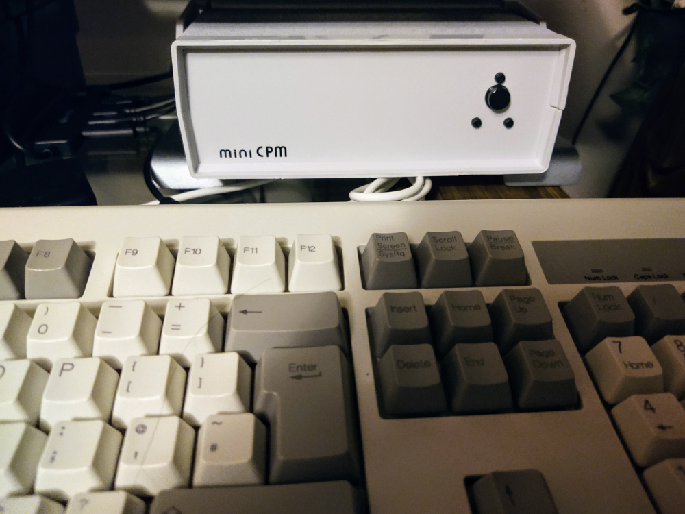
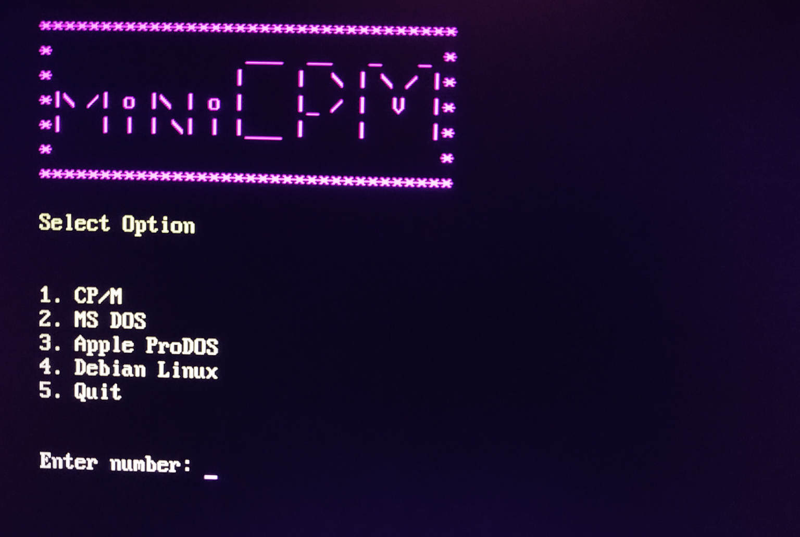
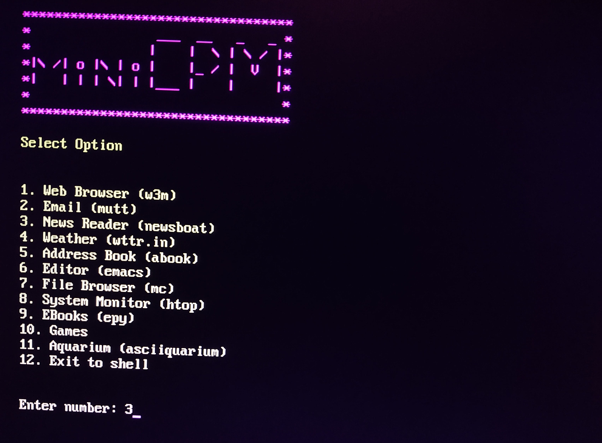

# miniCPM-menu


#### A small Python script to display a menu of shell scripts, receive menu choices and then execute the chosen script as a subprocess.

### Background

This menu script was written to provide a simple menu to select from a collection of CLI tools running on a Raspberry Pi Zero.

The Pi Zero was initially being used to provide serial access, via minicom, to an Arduino Due hosting the RunCPM Z80 CP/M emulator. I call this project miniCPM and it is housed in an enclosure as a desktop CP/M machine. It is handy for messing about with Z80 development (C, ASM, Turbo Pascal) and cheaper for myself than an actual Z80 SBC board, as I already had most of the components used.



### Menu

The top level of the menu interface allows the user to select between CP/M serial access, a couple of DOS emulators and a collection of CLI tools installed to the Pi OS. It also provides a Quit option to shut down the Pi Zero. The Pi Zero is configured to run this menu on booting.



The CLI tools were ones I would use regularly (e.g. an RSS reader, weather monitor and email client) within the same session, so I wanted to open each tool in its own child process and return to the top level menu after the child process had been closed. To make this happen I am using the **subprocess** library. 

```python 
    def execute_script(script_name):
    try:
        subprocess.run(f'bash {script_name}', shell=True, check=True)
    except subprocess.CalledProcessError as e:
        # Handle any errors if the script fails
        print(f'Error executing {script_name}: {e}')
        return
```



### Summary

There many other ways this solution could have been engineered but using **subprocess** was quick, simple and allowed me to utilise the Python runtime already installed with the Pi OS. 


